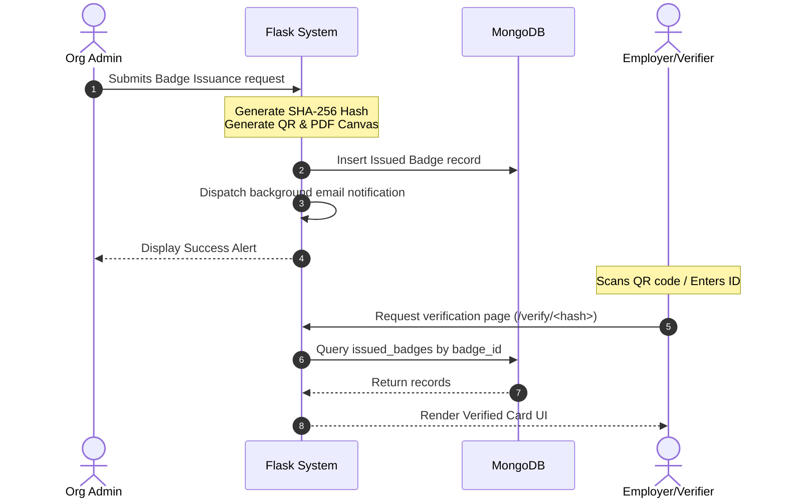

# Project Report: SmallBadge - Digital Badge Issuing & Verification Platform
## Course: Master of Computer Applications (MCA) Major Project Report

---

## 1. Abstract
The traditional credentialing system relies heavily on physical paper certificates and static digital PDFs, both of which are highly vulnerable to forgery and require slow, manual verification processes. **SmallBadge** is a secure, digital badge issuing and verification web platform designed to solve these issues. Built using Python, Flask, and MongoDB, SmallBadge allows verified institutions to design, issue, and manage digital badges. Each credential is bound to a unique cryptographic hash (SHA-256) and is instantly shareable and verifiable via public lookups or QR code scans. This system provides a secure, lightweight, and scalable alternative to expensive blockchain-based solutions, optimizing institutional workflow and enhancing corporate verification efficiency.

---

## 2. Introduction
In today's digital-first educational and corporate environment, credential fraud has become a significant concern. Employers are presented with resumes listing accomplishments that are difficult and slow to verify. 
SmallBadge bridges this trust gap by introducing a decentralized verification loop. When an organization registers and is approved by the platform's Super Admin, it gains the ability to enroll courses, register students, design visual templates, and instantly issue secure badges. Students get a centralized digital portfolio where they can view, download, and share their credentials. Any third party can scan the QR code printed on the badge to immediately confirm its validity, owner details, and issuing authority.

---

## 3. Literature Survey

### 3.1 Traditional Systems
Traditional verification systems are paper-bound, calling for physical validation or background check organizations. This results in high administrative costs and days of delay.

### 3.2 Blockchain-Based Credentials (e.g., Blockcerts)
While blockchain systems offer immutable trust, they suffer from high transaction fees (gas fees), slow execution rates, and complex key-management setups that are unsuitable for small-to-medium schools, training bootcamps, and local corporate divisions.

### 3.3 Proposed SmallBadge Solution
SmallBadge offers a centralized, highly optimized database lookup model using MongoDB. We achieve tamper-proofing by binding badge verification to a cryptographically secure 64-character hash. If any details on a certificate are modified, it will fail to match the unique verification hash registry in our database.

---

## 4. Software & Hardware Requirements

### 4.1 Software Requirements
* **Operating System**: Windows 10/11, macOS, or Linux.
* **Development IDE**: Visual Studio Code.
* **Backend Runtime**: Python 3.10+.
* **Web Framework**: Flask 3.0+.
* **Database Engine**: MongoDB Community Edition (v6.0+).
* **Key Packages**: PyMongo, Pillow, qrcode, reportlab, pandas, bcrypt.

### 4.2 Hardware Requirements
* **Processor**: Intel Core i3 / i5 or Apple M1/M2 processor.
* **Random Access Memory (RAM)**: 8 GB or higher recommended.
* **Storage Space**: 500 MB minimum for codebase, with database storage matching document scaling.

---

## 5. System Analysis & UML Diagrams

### 5.1 Use Case Diagram
Representing user interactions across roles:

```mermaid
left_to_right_direction
actor "Super Admin" as Admin
actor "Org Admin" as Org
actor "Student" as Stud
actor "Public User" as Public

rectangle "SmallBadge Platform" {
  Admin --> (Approve / Suspend Organizations)
  Admin --> (Monitor Platform Analytics)
  
  Org --> (Manage Courses & Templates)
  Org --> (Register Students & Import CSV)
  Org --> (Issue & Revoke Badges)
  
  Stud --> (View Portfolio & Share Badges)
  Stud --> (Download PDF Certificates)
  
  Public --> (Verify Badge Authenticity via ID/QR)
}
```

### 5.2 Sequence Diagram: Badge Issuance & Verification Flow
Illustrates the sequence of messages between the Org Admin, Backend System, MongoDB, and the Public Verifier:



---

## 6. Core System Algorithms

### 6.1 Bcrypt Password Hashing
Bcrypt is a key-stretching hashing function based on the Blowfish cipher. It introduces a random work-factor salt to generate a 60-character output:
$$\text{Hash} = \text{bcrypt}(Password, Salt)$$
This prevents dictionary attacks and pre-calculated rainbow-table cracks.

### 6.2 SHA-256 Badge ID Generation
We compile metadata attributes to compute a unique credential footprint:
$$\text{BadgeID} = \text{SHA256}(\text{StudentID} + \text{"-"} + \text{CourseID} + \text{"-"} + \text{TemplateID} + \text{"-"} + \text{Timestamp})$$
This ensures that even if a student receives multiple badges, each badge has a completely different hash footprint.

---

## 7. Future Scope & Conclusion

### 7.1 Future Scope
* **Blockchain Anchoring**: Periodically hashing database states to a public ledger (e.g. Polygon or Ethereum testnets) to implement a hybrid validation protocol.
* **LinkedIn API Integration**: Fully automated posting directly into the LinkedIn Certifications profile section rather than manual link forwarding.
* **Camera-Based Web UI Scan**: Integrating client-side HTML5 camera scanners directly onto the landing page.

### 7.2 Conclusion
SmallBadge is a robust, clean, and highly secure digital badging platform. It satisfies MCA project requirements by utilizing modern software engineering practices: Application Factory blueprint design, NoSQL database integration, unique cryptographic validations, and robust role security layouts.
